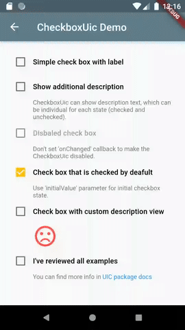

# UIC (UI Components)

A set of Flutter widgets that simplifies implementing most used UI cases.

Currently includes the following UI components:
- [CheckboxUic](#checkboxuic) - Enhanced **Checkbox** that maintain its state, has a title and can show additional description in each state.
- [ListUic](#listuic) - Wrapper of **ListView**, which implements related data loading and state management logic.
- `ProgressUic` - Wrapper of **ProgressIndicator** with additional text.

# [CheckboxUic](#checkboxuic)
Enhanced, but still simple, check box widget. Unlike original Checkbox widget, **CheckboxUic** maintain its state. Also it can has a title and description.

- Supports all original parameters of Checkbox Flutter widget
- Has initial value
- Shows a title, which can be individual for checked and unchecked state
- Optionally shows additional text description, which can be individual for checked and unchecked state
- Supports custom widgets instead of text description



# [ListUic](#listuic)

Almost each app has screens that display a list of items. Simple task at first look, it often requires much related staff to be implemented. All that boilerplate can be simplified with **ListUic** widget.

#### Features:
- Pull to Refresh gesture to reload list data
- Pagination (infinite scroll) to load next part of data on scroll to the end of the list
- Progress indicator for initial data loading
- Individual view for empty data
- Individual error view
- Progress indicator at the end of list when next page of items is loading
- Showing snack bar on failing loading data

&nbsp;&nbsp;

## Usage

In the `dependencies:` section of your `pubspec.yaml`, add the following line:

```yaml
dependencies:
  uic: ^0.3.0
```

### [CheckboxUic](#checkboxuic-usage)

Import the package

```dart
import 'package:uic/checkbox_uic.dart';
```

Simple usage of `CheckboxUic`:

<pre><code>
  @override
  Widget build(BuildContext context) {
    return Scaffold(
      appBar: AppBar(
        title: Text(widget.title),
      ),
      body: <b>CheckboxUic(
          initialState: true,
          title: 'Show additional description',
          description: 'This is description for checked state.',
          descriptionUnchecked: 'CheckboxUic can show description text, which can be '
              'individual for each state (checked and unchecked).',
          onChanged: (value) {
            print('$value');
          },
      ),</b>
    );
  }
</code></pre>

See more examples in [demo app](https://github.com/ech89899/uic-flutter/tree/master/example/lib/checkboxuic_screen.dart).

### [ListUic](#listuic-usage)

Import the package

```dart
import 'package:uic/list_uic.dart';
```

Add `ListUicController` to your page's state:

<pre><code>
class _MyHomePageState extends State&lt;MyHomePage&gt; {

  <b>ListUicController&lt;int&gt; _controller;</b>
  ...
  
  @override
  void initState() {
    super.initState();
    <b>_controller = ListUicController&lt;int&gt;(
      onGetItems: (int page) => _getItems(page),
    );</b>
    ...
  }
  ...
}
</code></pre>

Add `ListUic` widget to your widget tree:

<pre><code>
  @override
  Widget build(BuildContext context) {
    return Scaffold(
      appBar: AppBar(
        title: Text(widget.title),
      ),
      body: <b>ListUic&lt;int&gt;(
        controller: _controller,
        itemBuilder: (item) {
          return ListTile(
            title: Text('Title ${item}'),
            subtitle: Text('Subtitle ${item}'),
          );
        },
      ),</b>
    );
  }
</code></pre>

Implement a function that will return a list of items:

<pre><code>
  Future&lt;List&lt;int&gt;&gt; _getItems(int page) async {
    ...
  }
</code></pre>

Read the docs for available customization options.

Also you can check [demo app](https://github.com/ech89899/uic-flutter/tree/master/example) for details of using `ListUic` widget.